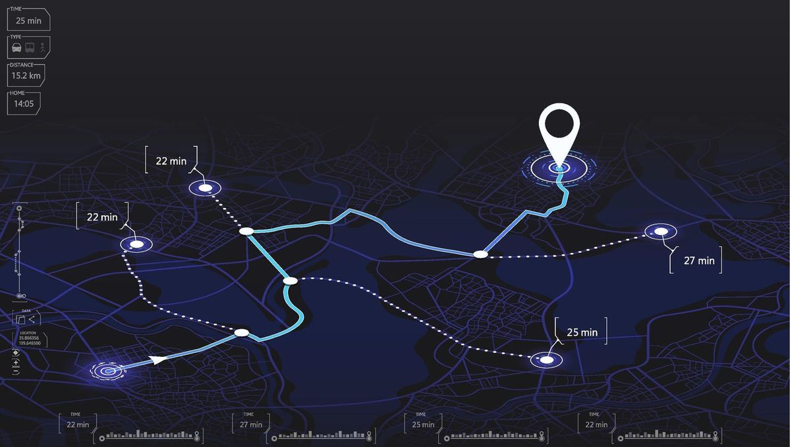

# 🚀 Smart Route Planner

A web-based application that finds the shortest path between locations using Dijkstra’s Algorithm.

---

## 📌 Features

- Add roads between locations with distance
- Automatically builds a graph
- Find the shortest route between any two points
- Displays path and total distance
- Clean and responsive UI

---

## 🧠 How it Works

- Locations = Nodes  
- Roads = Edges (with distance)  
- Uses Dijkstra’s Algorithm to calculate shortest path  

---

## 🛠️ Tech Stack

- HTML  
- CSS  
- JavaScript  

---

## 📷 Preview

<p>
	
	
</p>

```
Smart Route Planner
├── index.html
├── style.css
├── script.js
└── SmartRoute.jpg
```


---

